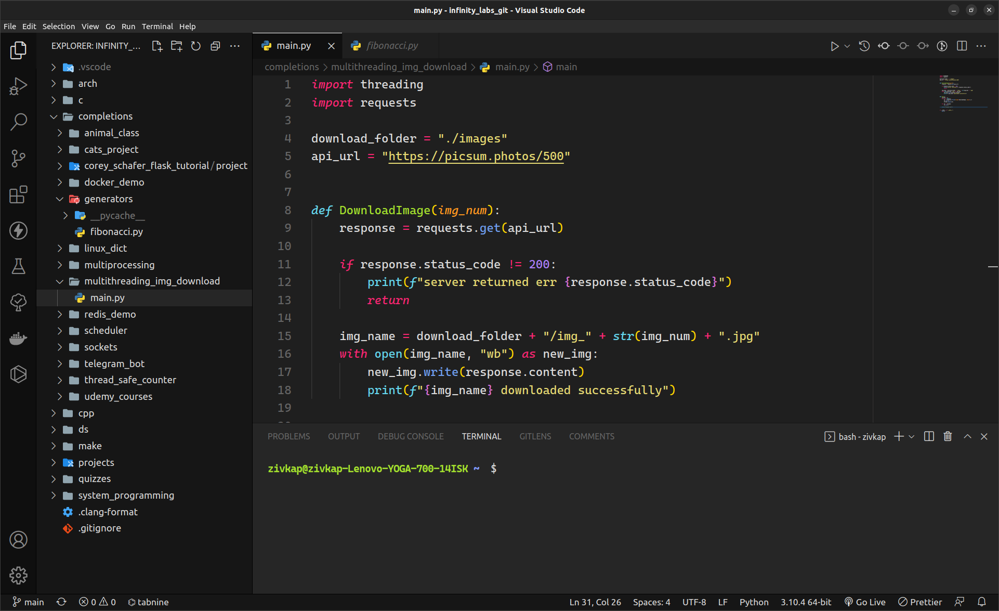
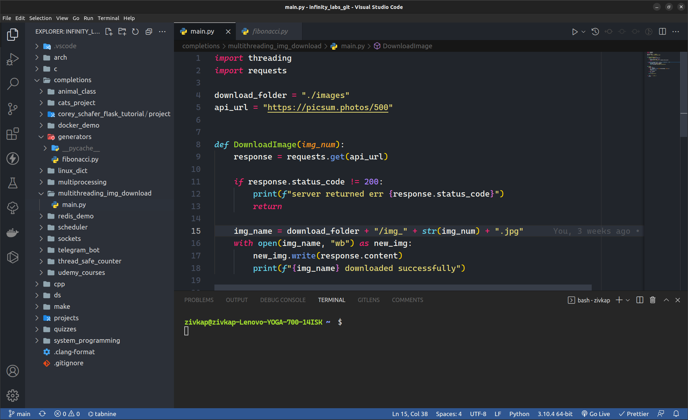

# Monokai Night Z

🌑 Dark theme package with vibrant colors for Visual Studio Code.
🍴 Based on [Monoakai Night](https://github.com/fabiospampinato/vscode-monokai-night) by Fabio Spampinato.

---

## ⬇️ Install

Launch VS Code Quick Open (Ctrl+P), paste the following command, and press enter.

```shell
ext install ZivKaplan.monokai-night-z
```

The theme page on Visual Studio [Marketplace](https://marketplace.visualstudio.com/items?itemName=ZivKaplan.monokai-night-z)

---

## 🏁 Usage

-   Open the theme selctor (Ctrl+K Ctrl+T) or launch VS Code Quick Open (Ctrl+P) and choose `Preferences: Color Theme`.
-   Choose your new favorite `Monokai Night Z` theme!

---

## 📸 Screenshots

font: Cascadia Code





---

## 🌱 Contributing

Feel free to open an issue or a pull request to help improve the themes!
